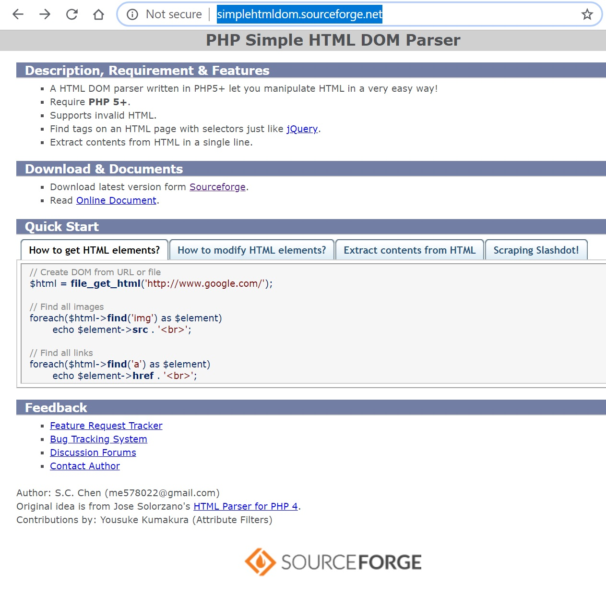
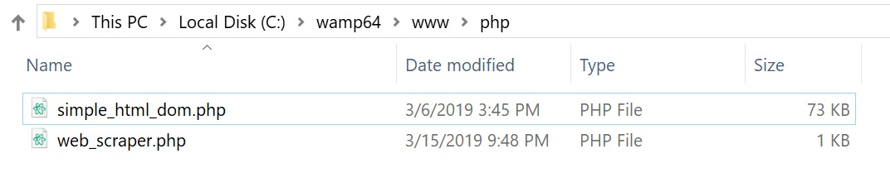

In this article I will be showing you how to use PHP to scrape a web page. This article assumes that you have a basic understanding of PHP and programming concepts, and that you have access to a server capable of running PHP. If you do not have access to a server capable of running PHP, you can [install WAMP on Windows 10 by watching my installation video](/articles/legacy/wamp-server/). In a way, scraping involves reverse engineering a web page so it helps to be familiar with HTML.

<!--truncate-->

<link rel="stylesheet" href="/legacy/jmm-video.css" />

<div class="jmm-video-container">
    <iframe class="jmm-video" src="https://www.youtube.com/embed/Uc5mfudMTKE" frameborder="0" allow="accelerometer; encrypted-media; gyroscope; picture-in-picture" allowfullscreen></iframe>
</div>

<br />

# Web Scraping With PHP

:::info
I have written this article in text form in order to save you time. In my experience, reading an article is often faster and/or more convenient (certainly quieter) than watching a video. If you would prefer to view this information in video form, you can click the video above, or [view the video on YouTube](https://www.youtube.com/watch?v=Uc5mfudMTKE).
:::

Although there are other ways to scrape a web page with PHP, this article will focus on the Simple HTML DOM Parser. I have chosen to use this library because this is the library that I have experiance with and it is easy to use with great documentation.

:::danger[Disclaimer]

- Do not wep scrape maliciously.
- Do not scrape to steal data.

YOU are responsible for anything you do with the skills you learn in this article and/or video.
:::

## Installing the Library

The first thing you need to do is download the scraping library from SourceForge. You can do this by going to http://simplehtmldom.sourceforge.net/ and clicking on "Download latest version from SourceForge".



Once you have downloaded the library from SourceForge, unzip the compressed folder. Then move the "simple_html_dom.php" file to the folder that you will be building the web scraper in.



## Writing the Scraping Code

Now that we have our library installed we can begin writing our scraping code.

```php
<?php
   # This imports and gives us access to the scraping library
   include('simple_html_dom.php');
?>
```

Now that we have access to the scraping library, we can use the file_get_html function to create a DOM object from a url.

```php
<?php
   # This imports and gives us access to the scraping library
   include('simple_html_dom.php');
   
   # Create HTML DOM object from url
   $html = file_get_html('https://google.com');
?>
```

We can then pull specific elements from this DOM object by calling the find method and passing in the tag name of the element we would like to grab. We can also pass an index if we would like to grab only a single instance of a particular tag. If we want to grab an array of tags, we refrain from passing an index.

```php
# Create HTML DOM object from url
$html = file_get_html('https://google.com');
   
# Gets the 0th title element from the DOM object and echos it to the webpage
echo $html->find('title',0);
   
# If we don't pass an index we can get an array of all the anchor elements from the DOM object
$array_of_anchors = $html->find('a');
   
# We can echo all of the anchor elements from the array above by using a simple for loop
for( $i = 0; $i < sizeof($list_of_anchors); $i++ ){
   # echo each anchor by using the $i iterator to pull the anchor in each index position
   echo $list_of_anchors[$i];
}
```

In addition to selecting elements based on their tag name, we can select elements based on class or ID.

```php
$html = file_get_html('https://google.com');
    
$array_of_hidden_divs = $html->find('div[class="hidden"]');
    
$array_of_thumbnails = $html->find('img[id="thumbnail"]');
```

The find method returns a DOM object. This means that we can call the find method on itself to grab child elements.

```php
$html = file_get_html('https://google.com');
   
$ul = $html->find('ul',0);
   
$array_of_li = $ul->find('li');
   
# This is the same as above, but in a single line
$array_of_li = $html->find('ul',0)->find('li');
```

We can extract certain data such as the text of an element, or the hyperlink reference of an anchor tag, or the source of an image.

```php
$html = file_get_html('https://google.com');
    
$button_text = $html->find('button',0)->plaintext;
 
$anchor_href = $html->find('a',0)->href;
 
$image_source = $html->find('img',0)->src;
```


