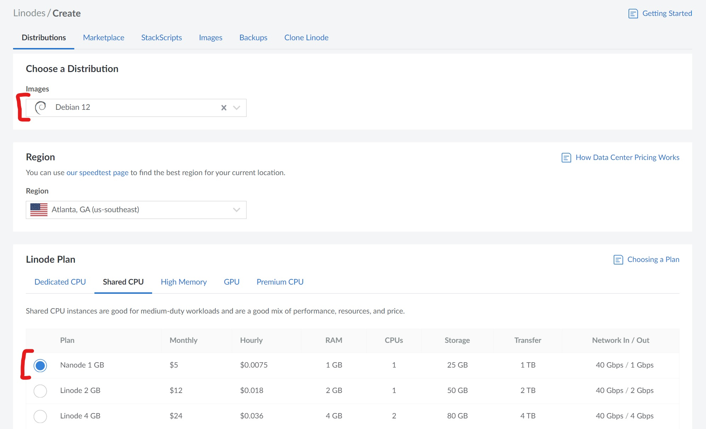
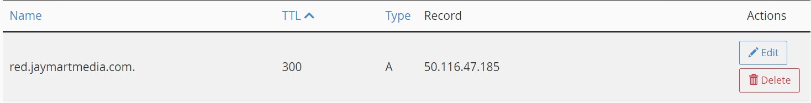
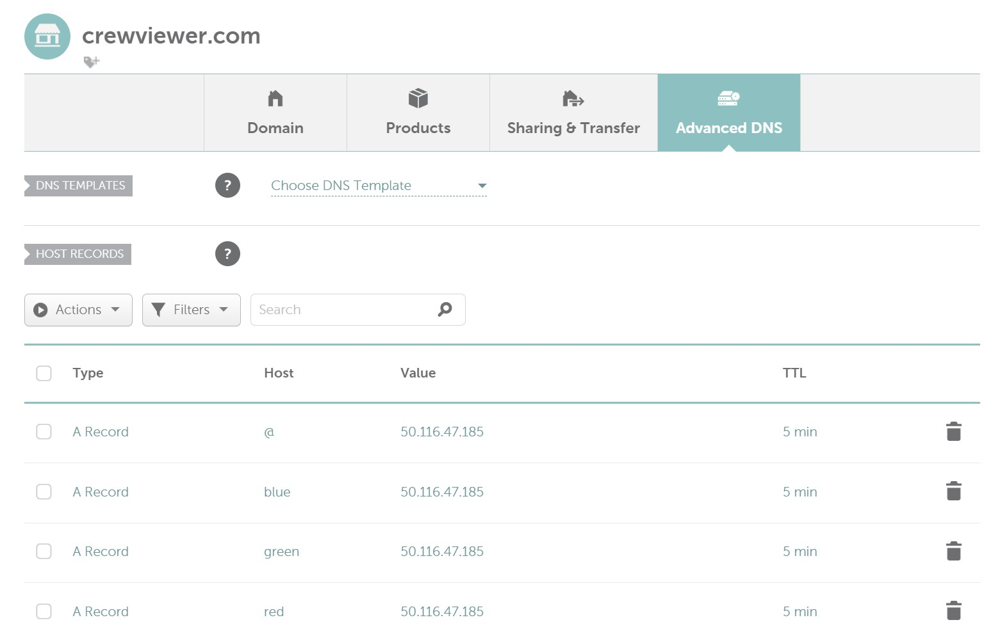
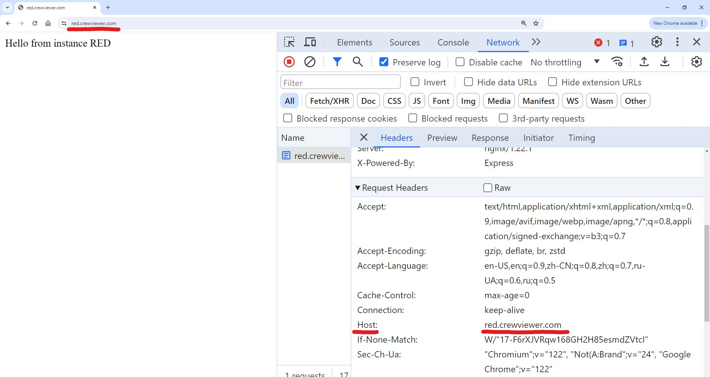

In this article we will set up an NGINX reverse proxy which will allow us to serve multiple sites on port 80 and 443 (default http/https ports) from a single server.

<!--truncate-->

<link rel="stylesheet" href="/legacy/jmm-video.css" />

<div class="jmm-video-container">
    <iframe class="jmm-video" src="https://www.youtube.com/embed/m1MWjPKS5NM" frameborder="0" allow="accelerometer; encrypted-media; gyroscope; picture-in-picture" allowfullscreen></iframe>
</div>

<br />

:::info
I have written this article in text form in order to save you time. In my experience, reading an article is often faster and/or more convenient (certainly quieter) than watching a video. If you would prefer to view this information in video form, you can click the video above, or [view the video on YouTube](https://www.youtube.com/watch?v=m1MWjPKS5NM).
:::

## Overview

- Pre-configuration:
    - Configure a Linode Nanode VPS (optional)
    - Install Docker (optional)
    - Run some example sites (optional)
- Set up DNS to point domain names at the server public IP address
- Install NGINX on the server
- Walk through setting up NGINX as a reverse proxy in a step-by-step manner
- Use Certbot to install TLS certificates for NGINX (technically optional)

Each of these steps will follow a step by step manner with validation in between. I feel that small steps make it easier to understand what each change does, and makes it easier to debug if needed.

This article begins by configuring a server with the prerequisites for the demonstration. These first steps (Linode, Docker, example sites in Docker) are all optional if you already have an existing server running some web sites. But you can always spin up a Nanode instance for a few hours to follow the tutorial, then delete it once you're done. At the time of writing, a single Nanode costs ~$0.18 per day.

After the initial configuration we will create some DNS A records to point the domain names at the public IP address of the server. If you don't own a domain, I also explain how to use the hosts file to work around this locally.

Then we will install NGINX on the server, in this article we are using Linux, but you should be able to do [something similar with NGINX on Windows](https://medium.com/@chandramuthuraj/installing-nginx-on-windows-a-step-by-step-guide-6750575c63e2). Once NGINX is installed, we will look at the default configuration. Then we will configure NGINX as a reverse proxy.

Finally we will enable HTTPS on the reverse proxy using Certbot. Certbot does appear to be [compatible with Windows](https://certbot.eff.org/instructions?ws=nginx&os=windows) although I have not used Certbot on Windows myself.

### What is a reverse proxy and why would I need one?

Only a single process can listen on a specific port, in fact the purpose of a port is to specify which process a TCP/UDP packet/datagram should go to.

For that reason, if multiple sites are running on a server, they must each be running on a different port.

Setting up a reverse proxy will allow all requests to be sent to the reverse proxy on the default HTTP/HTTPS ports (80, 443) and then forwarded to the respective app based on the value of the host header. This way the end user does not need to remember the port number for each site, they only need to remember the domain name.

#### Architecture diagram

On the right side of the diagram is the server on which the sites are running. The bottom section of the server shows each site and the port they are listening on (RED instance, GREEN instance, BLUE instance, etc.), the top section shows the NGINX reverse proxy listening on ports 80 and 443.

The red bounding box shows how requests are routed without the use of a reverse proxy. Without a reverse proxy the requests are routed to each site based on the port of the request. The down side of this approach is that users must know the port that each site is running on. Most users aren't even aware of the concept of a port, so this will be confusing and lead to a bad user experience.

The blue bounding box shows how requests are routed when using a reverse proxy. In this case the reverse proxy is listening on ports 80 and 443, the default HTTP and HTTPS ports. This means that users do not need to provide a port number, since when the port is excluded, the default port for the protocol is used. Since all requests use the same ports, the reverse proxy will use the host header to route the request to the specific site. The host header is included in each request by the HTTP client (browser or otherwise) that the user is using. When the reverse proxy receives the request, it looks at the host header, checks the mapping, and proxies the request to the proper site.


## Pre-configuration

The Linode, Docker and example app set up steps are completely optional.

We are using Linode in this article because it's cheap and easy to get a server up and running with a public IP address. If you have an existing VPS, or physical server/computer on your home network then you can use that.

We will use Docker as a simple way to run multiple site to demonstrate how the reverse proxy works. If you're watching this video, you likely already have multiple sites running that you would like to put the reverse proxy in front of. You are welcome to follow through the Docker steps as a way to get some hands-on experience as part of the tutorial, or you can just use your existing sites.

### Linode VPS (optional)

We'll be using a [Linode](https://www.linode.com/) Nanode (small VPS) running Debian 12 for this article. As mentioned above, nothing in this video is specific to Linode, so you can use any cloud provider of your choosing, or you could run this on your own server.



### Install Docker (optional)

The following steps to set up Docker on Debian were taken from the Docker site. Feel free to refer to the [first-party documentation](https://docs.docker.com/engine/install/debian/).

To check if you have Docker installed already on your server, you can run `docker --version`. If this returns a Docker version, then you may be good to go, otherwise you can follow the steps below.

```sh
# Install docker: https://docs.docker.com/engine/install/debian/
# Setup apt repositories for docker
sudo apt-get update
sudo apt-get install ca-certificates curl
sudo install -m 0755 -d /etc/apt/keyrings
sudo curl -fsSL https://download.docker.com/linux/debian/gpg -o /etc/apt/keyrings/docker.asc
sudo chmod a+r /etc/apt/keyrings/docker.asc

# Add the repository to Apt sources:
echo \
  "deb [arch=$(dpkg --print-architecture) signed-by=/etc/apt/keyrings/docker.asc] https://download.docker.com/linux/debian \
  $(. /etc/os-release && echo "$VERSION_CODENAME") stable" | \
  sudo tee /etc/apt/sources.list.d/docker.list > /dev/null
sudo apt-get update

# Install docker
sudo apt-get install docker-ce docker-ce-cli containerd.io docker-buildx-plugin docker-compose-plugin

# Test docker
sudo docker run hello-world
```

### Startup example sites in Docker (optional)

If you have chosen to install Docker, you can use the following commands to run three instances of the [micro-express](https://hub.docker.com/r/jaymartmedia/micro-express) Docker container which can be used to test the reverse proxy. These commands will set up the containers to listen on ports 5000, 5001, 5002 and each return a unique message to indicate which container received the request. You can change the INSTANCE_ID and MESSAGE environment variables to be something more memorable/meaningful to you if you want to.

```sh
docker run -d -p 5000:3000 --name 000 -e MESSAGE="Hello from instance RED"   -e INSTANCE_ID="RED"   jaymartmedia/micro-express:0.0.1
docker run -d -p 5001:3000 --name 001 -e MESSAGE="Hello from instance GREEN" -e INSTANCE_ID="GREEN" jaymartmedia/micro-express:0.0.1
docker run -d -p 5002:3000 --name 002 -e MESSAGE="Hello from instance BLUE"  -e INSTANCE_ID="BLUE"  jaymartmedia/micro-express:0.0.1
docker run -d -p 5003:3000 --name 003 -e MESSAGE="Hello from instance ROOT"  -e INSTANCE_ID="ROOT"  jaymartmedia/micro-express:0.0.1
```

Run the following CURL commands on the server to test the containers

```sh
curl localhost:5000 # Should return "Hello from instance RED"   (or the message you specified if you change it)
curl localhost:5001 # Should return "Hello from instance GREEN" (or the message you specified if you change it)
curl localhost:5002 # Should return "Hello from instance BLUE"  (or the message you specified if you change it)
curl localhost:5003 # Should return "Hello from instance ROOT"  (or the message you specified if you change it)
```

Run the following CURL commands from another machine (or enter each URL in your browser) to make sure that your app is publicly accessible. If you are using a computer on your home network as the server then you will have to set it up to be publicly accessible, likely by configuring NAT rules in your router. This is outside of the scope of this tutorial, but you can refer to [this superuser answer](https://superuser.com/a/965590) and Google "\{router model\} NAT setup" to get you started in the correct direction. You don't need any special set up for the client.

```sh
# Replace 50.116.47.185 with the public IP address of the server.
# You could also go to 50.116.47.185:5000 in your browser if you don't have CURL installed
curl 50.116.47.185:5000 # Should return "Hello from instance RED"
curl 50.116.47.185:5001 # Should return "Hello from instance GREEN"
curl 50.116.47.185:5002 # Should return "Hello from instance BLUE"
curl 50.116.47.185:5003 # Should return "Hello from instance ROOT"
```

## DNS

The Domain Name System is used to point human-readable domain names to specific IP addresses. DNS also does other things, but pointing domain names to IPv4 addresses with "A records" is all we will be doing in this article.

### Set up DNS

:::info[Workaround if you don't have a domain]
If you don't have a domain name, you can buy one now or just skip down to the [hosts file section](#edit-the-hosts-file-if-you-dont-have-a-domain) to use a work-around.
:::

If you own a domain name, you will need to create "A records" which point to the public IP address of your server. If your domain is in use, then you can use subdomains as I have in some of the examples below. For TTL (time-to-live) any value works, but for testing frequent changes low values such as 300-600 seconds (5-10 minutes) is convenient. The screenshots below show examples of both a root domain (crewviewer.com) as well as subdomains (red.jaymartmedia.com, green.crewviewer.com, etc.).

Example of A record in CPanel:


Example of A record in Namecheap:


Once the A records are set up, they can take some time to [propagate](https://www.digicert.com/faq/dns/what-is-dns-propagation). You can use a tool such as https://dnschecker.org/ to check whether they have propagated.

:::info[Workaround if you don't have a domain]
### Edit the hosts file if you don't have a domain
If you don't have a domain name yet, you can test via manual host file changes on the client. These changes will only take effect for the system where the host file change is made.

In short you will need to open "/etc/hosts" (Linux) or "c:\windows\system32\drivers\etc\hosts" (Windows) in admin mode and add a line such as "50.116.47.185 green.crewviewer.com". You will need to replace the IP address in the example with the public IP address of your server.

Read this article for more info about how to edit your host file: https://www.howtogeek.com/27350/beginner-geek-how-to-edit-your-hosts-file/
:::

### Validate DNS

Once the DNS A records have propagated (or you have edited your hosts file) you can visit the domains. Since the reverse proxy hasn't been set up yet, you will also have to specify the port:
- http://red.jaymartmedia.com:5000 - "Hello from instance RED"
- http://green.crewviewer.com:5001 - "Hello from instance GREEN"
- http://blue.crewviewer.com:5002 - "Hello from instance BLUE"
- http://crewviewer.com:5003 - "Hello from instance ROOT"

Since the domains are all just pointing at the same IP address and only using port to differentiate the site, you could also do:
- http://red.jaymartmedia.com:5003 - "Hello from instance ROOT"

You could also use any of the other domain name + port combinations. The site is determined strictly based on the port (as shown in the red section of architecture diagram). 

This is likely not the desired configuration for two reasons:
- The red.jaymartmedia.com domain should only point to the RED instance, NOT root
- The need to include the port is inconvenient and users would need to know what port they need to use

The NGINX reverse proxy will solve both of these issues.

### Host header

For each request that is made, the HTTP client (CURL, or the browser) will add a host header which is equal to the domain name that the request is made to. Below is a screenshot of the host header that is set by the browser when we visit red.crewviewer.com.



In one of the following steps we will configure NGINX to proxy the request to a specific site based on the host header that is set by the client.

## NGINX

NGINX is a web-server software product that contains a lot of functionality such as serving static pages, some server-side pages, load balancing, and acting as a reverse proxy (what we'll be using). NGINX has some paid products, in this article we will be using [NGINX open-source](https://docs.nginx.com/nginx/admin-guide/installing-nginx/installing-nginx-open-source/).

### Install NGINX

We can run the following commands to start and run NGINX on Debian.

```sh
# Install nginx: https://www.nginx.com/resources/wiki/start/topics/tutorials/install/
sudo apt update
sudo apt install nginx

# May not be required
sudo systemctl start nginx
```

### Validate default NGINX configuration

Test NGINX on the server via localhost and we should see the default NGINX welcome page.

```sh
curl localhost:80
```

We can also reach NGINX remotely via the public IP address as well as the DNS records that we set up earlier. Since NGINX runs on port 80 by default, and port 80 is the default http port, we don't need to specify the port. This is how users visit most other sites on the web. Since all of the following urls default to port 80, they all return the same default NGINX welcome page.

```sh
curl http://50.116.47.185
curl http://red.jaymartmedia.com
curl http://green.crewviewer.com
curl http://blue.crewviewer.com
curl http://crewviewer.com
```

### Understand the default NGINX configuration

NGINX comes with a default configuration. We can view the configuration which is stored in the "/etc/nginx/sites-enabled/default" file by running `cat /etc/nginx/sites-enabled/default`.

```nginx title="/etc/nginx/sites-enabled/default"
server {
    listen 80 default_server;
    listen [::]:80 default_server;

    root /var/www/html;

    index index.html index.htm index.nginx-debian.html;

    server_name _;

    location / {
            # First attempt to serve request as file, then
            # as directory, then fall back to displaying a 404.
            try_files $uri $uri/ =404;
    }
}

```

We can see that the default configuration root path loads an html file from "TBD". We can view this default html file by running `cat TBD`.

```html title="/var/www/html/index.nginx-debian.html"
<!DOCTYPE html>
<html>
    <head>
        <title>Welcome to nginx!</title>
        <style>
            html { color-scheme: light dark; }
            body { width: 35em; margin: 0 auto;
            font-family: Tahoma, Verdana, Arial, sans-serif; }
        </style>
    </head>
    <body>
        <h1>Welcome to nginx!</h1>
        <p>If you see this page, the nginx web server is successfully installed and
        working. Further configuration is required.</p>

        <p>For online documentation and support please refer to
        <a href="http://nginx.org/">nginx.org</a>.<br/>
        Commercial support is available at
        <a href="http://nginx.com/">nginx.com</a>.</p>

        <p><em>Thank you for using nginx.</em></p>
    </body>
</html>

```

Notice that this is the same file that is returned by NGINX when we run `curl localhost`.

We will now delete this file so that we can write our own configuration file to set up the reverse proxy: `rm /etc/nginx/sites-enabled/default`

### Configure NGINX as a reverse proxy

We will configure the reverse proxy to proxy requests based on the host header rather than the port.

We will write our own configuration file to set up the reverse proxy. You can use nano, or any other visual or command line text editor. We will put the file in the "/etc/nginx/conf.d" directory and use the ".conf" extension so that NGINX will load our configuration file automatically when it is started.


#### Initial reverse proxy set up

We will add a server block to specify how NGINX should behave:
- **Line 4**: Specify the port for this server block to listen on. This should be port 80 since that is the default HTTP port.
- **Line 6**: Specify the server/host name that the server block should handle (red.jaymartmedia.com). Since we only have a single server block, this block will be treated as the default so ALL requests to port 80 will be handled here.
- **Line 10**: Specify what the server block should do with any requests to the root path and below (essentially any path). In this case we are sending the requests to "localhost:5000" which is where the RED instance is running.

```nginx title="/etc/nginx/conf.d/default.conf" showLineNumbers
### red.jaymartmedia.com
server {
    # Port that the reverse proxy will listen on
    listen 80;
    # Hostname that this server block should respond to (i.e. example.com, test.example.com, etc.)
    server_name red.jaymartmedia.com;

    location / {
        # Upstream server/site that the reverse proxy will connect to
        proxy_pass http://localhost:5000;
    }
}
```

We can restart NGINX by running `sudo systemctl restart nginx`.

Before when we made requests to this server on port 80, NGINX responded with the default NGINX welcome page. Now that we removed the default NGINX configuration and configured NGINX to be a reverse proxy, the requests will be proxied to the RED instance and we will get a response from the RED instance.

```sh
curl http://50.116.47.185 # Hello from instance RED
curl http://red.jaymartmedia.com # Hello from instance RED
curl http://green.crewviewer.com # Hello from instance RED
curl http://blue.crewviewer.com # Hello from instance RED
curl http://crewviewer.com # Hello from instance RED
```

Notice that all of the above requests reach the RED instance since the red server block is the default server block. We can fix this by explicitly defining a default server block.

#### Adding a default server block

We can define a default server block to handle any requests which do not match any server_names in any of the server blocks.

We can explicitly define a server block by using the keyword "default_server" (line 3). If we do not explicitly define the server block, NGINX will use the first server block by default.

This server block will also match requests on port 80. Only a single process can listen on a specific port, in fact the purpose of a port is to specify which process a TCP/UDP packet/datagram should go to. That is why we need the reverse proxy in the first place. In this case, since both server blocks are used by the same NGINX process, it is fine for multiple server blocks to match on port 80.

"return 502" (line 4) will cause NGINX to return a "502 Bad Gateway" response to any requests which don't match any of the server_names.

```nginx title="/etc/nginx/conf.d/default.conf" showLineNumbers {1-5}
### Default server
server {
    listen 80 default_server;
    return 502;
}

### red.jaymartmedia.com
server {
    # Port that the reverse proxy will listen on
    listen 80;
    # Hostname that this server block should respond to (i.e. example.com, test.example.com, etc.)
    server_name red.jaymartmedia.com;

    location / {
        # Upstream server/site that the reverse proxy will connect to
        proxy_pass http://localhost:5000;
    }
}
```

We can restart NGINX by running `sudo systemctl restart nginx`.

Before when we made requests to this server on port 80, all requests were proxied to the RED instance and we got a response from the RED instance. Now any requests with the "host: red.jaymartmedia.com" header will be proxied to the RED instance, but all other requests will use the default server block which returns the "502 Bad Gateway" response.

```sh
curl http://50.116.47.185 # 502 Bad Gateway
curl http://red.jaymartmedia.com # Hello from instance RED
curl http://green.crewviewer.com # 502 Bad Gateway
curl http://blue.crewviewer.com # 502 Bad Gateway
curl http://crewviewer.com # 502 Bad Gateway
```

#### Adding server blocks for more sites

We can duplicate the second server block and change the server_name and proxy_pass port values as needed for each site.

```nginx title="/etc/nginx/conf.d/default.conf" {20-44}
### Default server
server {
    listen 80 default_server;
    return 502;
}

### red.jaymartmedia.com
server {
    # Port that the reverse proxy will listen on
    listen 80;
    # Hostname that this server block should respond to (i.e. example.com, test.example.com, etc.)
    server_name red.jaymartmedia.com;

    location / {
        # Upstream server/site that the reverse proxy will connect to
        proxy_pass http://localhost:5000;
    }
}

### green.crewviewer.com
server {
    # Port that the reverse proxy will listen on
    listen 80;
    # Hostname that this server block should respond to (i.e. example.com, test.example.com, etc.)
    server_name green.crewviewer.com;

    location / {
        # Upstream server/site that the reverse proxy will connect to
        proxy_pass http://localhost:5001;
    }
}

### crewviewer.com
server {
    # Port that the reverse proxy will listen on
    listen 80;
    # Hostname that this server block should respond to (i.e. example.com, test.example.com, etc.)
    server_name crewviewer.com;

    location / {
        # Upstream server/site that the reverse proxy will connect to
        proxy_pass http://localhost:5003;
    }
}
```

We can restart NGINX by running `sudo systemctl restart nginx`.

Before when we made requests to this server, red.jaymartmedia.com went to RED instance, and all other requests went to the default server and returned 502 bad gateway errors. Now, after adding more server blocks, any requests with a host header which matches a server_names specified will go to the respective pod and any requests that don't match will go to the default server block.

```sh
curl http://50.116.47.185 # 502 Bad Gateway
curl http://red.jaymartmedia.com # Hello from instance RED
curl http://green.crewviewer.com # Hello from instance GREEN
curl http://blue.crewviewer.com # 502 Bad Gateway
curl http://crewviewer.com # Hello from instance ROOT
```

We can also explicitly set the host header using CURL so that our request matches a server name:
```sh
curl http://50.116.47.185 -H "host: red.jaymartmedia.com" # Hello from instance RED
```

I won't set up the server blocks for the other domains (because the default.conf file is getting big 😁), but by now it should be fairly clear how that would be done.

## HTTPS (technically optional)

So far all of our requests have used HTTP on port 80. This is fine for some sites, but it means that data moves across the network unencrypted which can allow other people to see your traffic. This is terrible for any security sensitive sites, for obvious reasons.

We can configure NGINX to handle HTTPS requests using a tool called Certbot. HTTPS encrypts traffic which prevents other people from viewing all of your traffic. By default HTTPS uses port 443.

:::warning[Workaround if you don't have a domain]
Unfortunately Certbot will only work if you have a domain, it will not work if you used the host file workaround. This is because the domain needs to be in the public DNS and accessible from the Let's Encrypt servers, but the host file change only applies to the computer that the change is made on.
:::

### Install Certbot

[Certbot](https://certbot.eff.org/) handles validation of your domain, installing the TLS certificate, and automatic renewal of the TLS certificate. Certbot uses a free TLS certificate authority called [Let's Encrypt](https://letsencrypt.org/).

The following commands install a package manager called Snap, remove old versions of Certbot, then install and set up Certbot.

```sh
# Install snapd: https://snapcraft.io/docs/installing-snap-on-debian
sudo apt update
sudo apt install snapd
# Uninstall old versions of certbot
sudo apt-get remove certbot
# Install certbot: https://certbot.eff.org/instructions?ws=nginx&os=debianbuster
sudo snap install --classic certbot
# Link certbot as executable bin
sudo ln -s /snap/bin/certbot /usr/bin/certbot
```

### Use Certbot to add TLS certificates for each domain

The Certbot command line tool can be used to install TLS certs. The [Certbot website](https://certbot.eff.org/instructions?ws=nginx&os=debianbuster) has a helpful wizard style UI to give specific instructions based on your web server and operating system.

The CLI tool has multiple options, it can install the cert but allow us to manually update the NGINX config file, or it can install the cert and automatically update the NGINX config file. We'll walk through both methods in this article.

#### Manually update the NGINX config file

Manually updating the NGINX config file to reference the TLS certificates may help to understand how it is set up. But once we understand what's going on, the convenience of the automatic command is very nice.

Run the following command on the server. Certbot will be prompt for a few options such as adding an email for upcoming expiration alerts, terms of service agreement, marketing email opt in/out, and selecting the domain that we want to get the certificate for.

```sh
# Install cert
sudo certbot certonly --nginx
# Enter email for warnings, Y to agree to ToS, Y/N for marketing emails, select the domain
```

Once the cert is installed, we will have to reference it from the NGINX configuration file. We can view the certificate and key by running the following commands:
- `ls /etc/letsencrypt/live/\{domain/host name\}/`
- `cat /etc/letsencrypt/live/\{domain/host name\}/fullchain.pem`
- `cat /etc/letsencrypt/live/\{domain/host name\}/privkey.pem`

These changes will be made to the existing config file, it will not completely replace the existing file. Update the default.conf file by adding a new server block that matches HTTPS requests on port 443 (lines 14-24). And update the port 80 server block to redirect to the page using HTTPS (lines 10-11).

```nginx title="/etc/nginx/conf.d/default.conf" showLineNumbers {10-11,14-24}
...

### red.jaymartmedia.com
server {
    # Port that the reverse proxy will listen on
    listen 80;
    # Hostname that this server block should respond to (i.e. example.com, test.example.com, etc.)
    server_name red.jaymartmedia.com;

    # Redirect to https version and retains path
    return 301 https://$host$request_uri;
}

server {
    listen 443 ssl;
    server_name red.jaymartmedia.com;

    ssl_certificate /etc/letsencrypt/live/red.jaymartmedia.com/fullchain.pem;
    ssl_certificate_key /etc/letsencrypt/live/red.jaymartmedia.com/privkey.pem;

    location / {
        proxy_pass http://localhost:5000;
    }
}

...
```

We can restart NGINX by running `sudo systemctl restart nginx`.

We can verify that HTTPS is set up for red.jaymartmedia.com, and if we try to go to https://green.crewviewer.com we will get a timeout since we haven't set up for that domain yet.

```sh
curl http://red.jaymartmedia.com # 301 redirect to https://red.jaymartmedia.com
curl https://red.jaymartmedia.com # Hello from instance RED
curl https://green.crewviewer.com # Will timeout since there are no server blocks that match green.crewviewer.com on port 443
```

If you go to http://red.jaymartmedia.com in your browser it should automatically redirect you to the page via HTTPS.

#### Allow Certbot to automatically update the NGINX config file

Before running the automatic certbot command we will backup our existing configuration file so we can compare the configuration files to see the changes that certbot makes.

`cp /etc/nginx/conf.d/default.conf /etc/nginx/conf.d/default.conf.bkp`

Run the following command on the server. If this is the first time that certbot is run, Certbot will prompt for a few options such as adding an email for upcoming expiration alerts, terms of service agreement, and marketing email opt in/out. Then Certbot will prompt for the domain that we want to get the certificate for.

```sh
# Install cert
sudo certbot --nginx
# Enter email for warnings, Y to agree to ToS, Y/N for marketing emails, select the domain
```

Run the following command to show the changes that NGINX made.

`diff /etc/nginx/conf.d/default.conf /etc/nginx/conf.d/default.conf.bkp`

Here is what the changes will likely look like.

```nginx title="/etc/nginx/conf.d/default.conf changes" showLineNumbers {1-1}
TBD diff
```

We can verify that HTTPS is set up for green.crewviewer.com.

```sh
curl http://green.crewviewer.com # 301 redirect to https://green.crewviewer.com
curl https://green.crewviewer.com # Hello from instance GREEN
```

If we go to http://green.crewviewer.com in the browser it should automatically redirect us to the page via HTTPS.

## Summary

In this article we:
- Set up DNS records to point at the IP address of a server
- Installed NGINX on the server
- Learned about the default NGINX configuration
- Configured NGINX as a reverse proxy using host headers to differentiate sites
- Used Certbot to install Let's Encrypt TLS certificates for our domains
- Configured NGINX (manually and automatically) to use the TLS certificates to enable HTTPS on our sites
